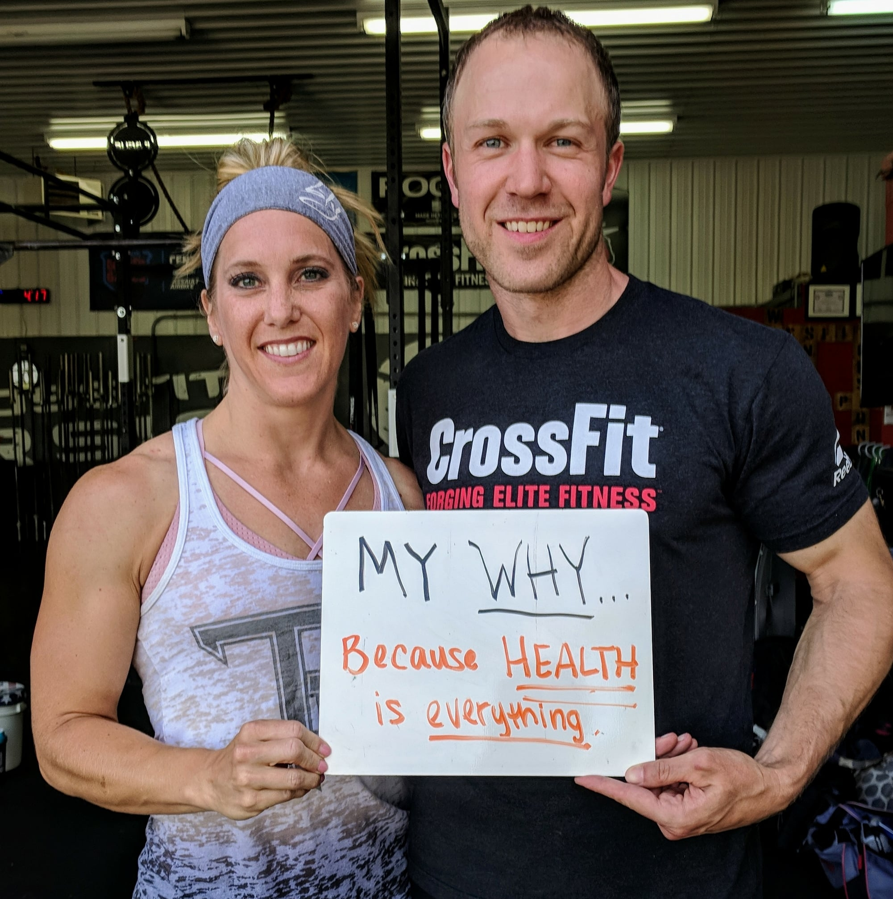
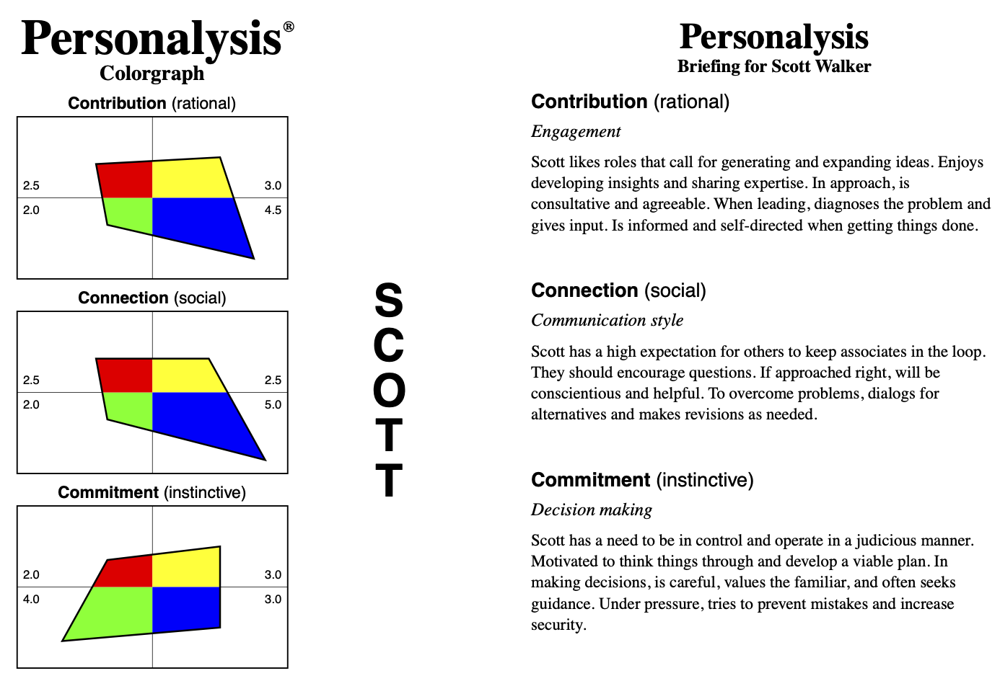

&nbsp;&nbsp;

&nbsp;&nbsp;

# Overview
This is part of an ongoing project I have in mind around how people get to know each other and how best to use that information to work together in teams.

This is how I **try** to live my life in all things. It's how I want to show up whether at home, at work, or anywhere else. Like any human I am fallible and will mess up from time to time. Anyone has full permission without reproach to call me on behavior that does not seem to match with these things. We all need accountability to aid growth.

 

## **MISSION:**

To build healthy and happy individuals, teams, and organizations that contribute to the world in meaningful ways.

 

## **VALUES:**

**Empathy -** _the experience of understanding another person's thoughts, feelings, and condition from their point of view, rather than from your own_
*   Give full attention to others by not becoming distracted when they are speaking to us.
*   Approach conflict with an open mind by considering the perspective of those we are in conflict with. Actively seek to understand their point of view.
*   Relate to co-workers and employees on more than a work level, actively inquire about their lives and remember what they say.

**Curiosity -** _a strong desire to know or learn something._
*   Understand the desires of others by asking probing questions.
*   Continually question how I can be better personally and professionally by seeking feedback.
*   When confronted with lack of understanding, educate myself rather than assume.

**Courage** – _the ability to do something that is frightening or uncomfortable._
*   Give feedback that is necessary but difficult in an empathetic way.
*   Question decisions that seem outside my personal or professional values.
*   Admit that I don’t know the answer to things, take accountability for screw ups.

**Connection** -- _the energy that exists between people when they feel seen, heard, and valued._

*   Collaborate in ways that utilize individual strengths to achieve shared goals.
*   Be an active participant in contributing to the teams, communities, and organizations I’m a part of.
*   Express gratitude for the work of others.

**Outcomes** – _the achievement of desired results._
*   Be flexible to allow different means to achieve the same goal.
*   Find solutions to problems that are a win for everyone involved. Don’t have a zero-sum mindset.
*   Commit and follow through with what I say I am going to do.

 

## **PERSONALITY:**

**Myers Briggs -** [INFJ (The Advocate)](https://www.16personalities.com/infj-personality)

[Highlights](Personalysis/Highlights.pdf) |
[Detailed Report](Personalysis/Detailed%20Report.pdf)

I sometimes become too invested in being a fixer of other people’s problems and need to step away for a period to recharge.

 

## **ETHOS:**

Everything has a story. If you understand the story, you understand the thing. The language we use and how we tell those stories matters. We can, through language, control if something is viewed as a triumph or a tragedy. Our language controls our thoughts, and our thoughts control our actions. Telling a story a different way is often an unlock for moving beyond.

Never forget my privilege. Educate myself and others about bias. Create diverse teams, communities, and organizations in which everyone feels safe and loved for who they are.

 

## **COMMUNICATION:**

I thrive on having a lot of context — very few details are too small or irrelevant. I listen deeply and ask a lot of questions before offering my input. Asking questions for me is not combative behavior, nor questioning your judgement. I am simply gathering the information I need to operate most effectively and building an understanding of how you think.

I very highly value the use of language in communications. If I appear quiet in a meeting or conversation I am likely contemplating what I want to say and how. I communicate best in writing so for important topics I will default to writing or at least use written notes to guide my verbal communications.

I’m happy to be communicated to in whatever fashion you find best.

 

## **INTERESTS:**

**Family —** Always my number one priority. I have a wonderful wife and two kids that mean the world to me.

**Health & Wellness —** I co-own a CrossFit gym ([CrossFit Torsion](https://www.crossfittorsion.com/)) with my wife and another friend. I'm very proud of our community and staff because they are diverse, welcoming, and supportive of everyone. I believe that health is everything as without it we can’t achieve anything else in life we wish to do. I train five times a week with CrossFit training methods and also coach a few times a week because when done well it’s the most effective way to achieve optimal, long term, well-rounded health. Coaching group fitness classes is also a great compliment to managing people in other environments. I also try to eat clean whole foods the majority of the time to support my wellness goals.

**Nature & The Outdoors —** I have always had an affinity for nature and am in my happy place when walking through the woods, hiking in the mountains, or kayaking. I want to retire someday to a house somewhere remote(ish) in the mountains, ideally near a national park.

**Photography —** This is for me the hobby that allows me to combine my interest in tech with my desire to be outside. I’ve been experimenting on and off with photography since I was a teenager and while I’m no pro, have over the years developed the ability to take some pretty good shots (in my opinion) which I share on my [personal gallery site](https://www.scottwalker.gallery/). Over the years I have used camera systems from Nikon, Olympus, Fuji, and Sony. I currently shoot with Canon gear. I would love to have something used in publication some day.

**Books —** I have been an avid reader for basically forever. I tremendously enjoy hunkering down with a good book and reading for hours. I’ll read most anything that is well-written but tend to gravitate towards fantasy / sci-fi for pure pleasure reading. On the more intellectual side of things I read a lot of psychology, philosophy, and things about building healthy teams and relationships.

**Games —** I don’t spend nearly as much time here as I used to, but I do still enjoy a good game now and again. From a video game standpoint I tend to prefer RPGs, or just about anything that has good co-op play as games are a bonding activity I do with my son. I also enjoy a board games of all types and collectible card games.

 

## **FEARS:**

* Irresponsible use of technology’s effect on society.

* Rampant consumerism and the resultant destruction of the environment / climate change.

* Current stage Capitalism’s effect on the vulnerable.

* Imposter syndrome

 

## **CHALLENGES:**

I sometimes suffer from migraine headaches. These usually start with ocular symptoms for me (blurry vision, flashing lights, floaters) and if caught early enough can be stopped at this stage before progressing into the full blown headache.  Afterwards though I nearly always have some level of persistent brain fog or the feeling that it’s hard to think for a day or sometimes more.

 

## **WORKING ON:**
* Understanding the lived experience of diverse populations, how I can better support them, and build teams who do the same.
* Ways to increase collaboration, connection, and engagement in teams, particularly when remote.
* Developing my photography skills.

 

## **FAVORITES:**

**Quotes:**

Too many to list easily, I have a whole library of things I’ve saved over the years that I find inspiring that I pull out when the need arises.

*   “_Storytelling is a tool for knowing who we are and what we want, too.  If we never find our experience described in poetry or stories, we assume that our experience is insignificant.”_ ~ Ursula K. LeGuin
*   _“To do the useful thing, to say the courageous thing, to contemplate the beautiful thing: that is enough for one man's life.”_ ~T.S. Eliot
*   _“Nothing ever goes away until it teaches us what we need to know.”_ ~ Pema Chödrön
*   _“Love people, use things because the opposite never works.”_ ~ The Minimalists

**Music: ([Spotify Profile](https://open.spotify.com/user/scott%2Bwalker))**

Highly dependent on what mood I’m in or want to be in, I listen to a wide swath of music. I’m always looking for new things to listen to. Some of my longstanding favorites include:

*   **[Hooverphonic - Amalfi](https://open.spotify.com/album/0YZcMRpRyTtVHtFlR1pTvo?si=4bYzYlzwQn-zPsSDcJP0Dg&dl_branch=1)**
*   **[Blackmill - Reach for Glory](https://open.spotify.com/album/0XHpO9qTpqJJQwa2zFxAAE?si=1z__1E6wROylY8ZDnPXrow&dl_branch=1)**
*   **[Within Temptation - Resist](https://open.spotify.com/album/1SL2IdaCrXDtv695Px6AXR?si=MIsP9ScBR0q51cXSsebUTw&dl_branch=1)**
*   **[The Attic Ends - The Sky Begins](https://open.spotify.com/album/19H4QsxHrtOruSkK62ZVkx?si=fc359b79248a4df8)**
*   **[Beth Orton - Central Reservation](https://open.spotify.com/album/6lijTrmA0yAucg4Axbj1up?si=239f2ff12a21494a)**

**Books: ([Goodreads Profile](https://www.goodreads.com/user/show/35240747-scott-walker))**

*   [Dare to Lead](https://www.goodreads.com/book/show/40109367-dare-to-lead?from_search=true&from_srp=true&qid=vXyBZVVuYI&rank=1)
*   [The School of Life: An Emotional Education](https://www.goodreads.com/notes/49627657-the-school-of-life/35240747-scott-walker?ref=abp)
*   [Managing Humans](https://www.goodreads.com/notes/31433313-managing-humans/35240747-scott-walker?ref=abp)
*   [Quiet: The Power of Introverts in a World That Can’t Stop Talking](https://www.goodreads.com/notes/36547901-quiet/35240747-scott-walker?ref=abp)
*   [Everything That Remains](https://www.goodreads.com/book/show/20370505-everything-that-remains)
*   [The Kingkiller Chronicles](https://www.goodreads.com/book/show/37670856-kingkiller-chronicle-patrick-rothfuss-collection-3-books-box-set--giftbo?ac=1&from_search=true&qid=s3lESZCVBG&rank=5)

**Podcasts: ([Spotify Profile](https://open.spotify.com/user/scott%2Bwalker))**

*   [Dare to Lead](https://open.spotify.com/show/3oEPsPKDhPVoNNL7pH5db6?si=krxSh1JTTSC0XucqdsA6ug&dl_branch=1)
*   [Hidden Brain](https://open.spotify.com/show/20Gf4IAauFrfj7RBkjcWxh?si=h9wda3awQ_6r9F4HU7G8qQ&dl_branch=1)
*   [How’s Work?](https://open.spotify.com/show/0P13JasQfVZ1RiDCMZMYNU?si=KLrgXI5ZTwCOppvACHWWrg&dl_branch=1)
*   [Wild Health](https://open.spotify.com/show/1UhJmFJH7yFy92U7D9flFi?si=123c136eb98142ac)